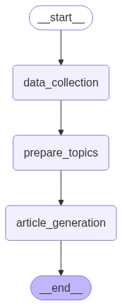
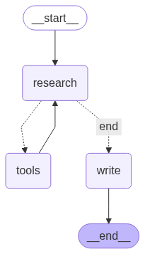

# Neuro News

An AI-driven platform that automates end-to-end news creation using LangGraph, React, Firebase, and multiple AI models. Neuro News continuously discovers trending topics, orchestrates multi-agent research and writing workflows, and publishes articles to a real-time frontend.

---

## Table of Contents

* [Features](#features)
* [Architecture Overview](#architecture-overview)
* [Setup & Installation](#setup--installation)

  * [Prerequisites](#prerequisites)
  * [Clone Repository](#clone-repository)
  * [Environment Configuration](#environment-configuration)
* [Running the Project](#running-the-project)

  * [Flask Backend](#flask-backend)
  * [LangGraph Workflow](#langgraph-workflow)
  * [Frontend](#frontend)
* [Data & Models](#data--models)
* [Daily Automation](#daily-automation)
* [License](#license)

---

## Features

* **Automated Topic Discovery**: Ingests RSS feeds and web search to identify high-impact news topics.
* **Multi-Agent Workflow**: Master and subordinate LangGraph agents outline, research, and draft articles.
* **Real-Time Frontend**: React app with Firebase Authentication and Firestore for live updates.
* **Modular & Extensible**: Easily swap AI models or add new data sources.

---

## Architecture Overview

### News Generation Workflow



### Article Generation Workflow



---

## Setup & Installation

### Prerequisites

* Python 3.10+
* Node.js 18+
* Firebase project with Firestore enabled
* Firebase Service Account JSON
* Ollama installed locally with the `qwen3:8b` model loaded

### Clone Repository

```bash
git clone https://github.com/mounty-ed/neural_news_project.git
cd neuro-news
```

### Environment Configuration

1. Create a Python virtual environment:

   ```bash
   python -m venv .venv
   source .venv/bin/activate
   pip install -r requirements.txt
   ```

2. Place your Firebase service account key in `back_end/firebase-service-account.json`.

3. Create a `.env` and set the following variables:

   ```ini
   TAVILY_API_KEY=your-tavily-key
   OPENROUTER_API_KEY=your-openrouter-key
   ```

> **Note:** Ollama must be running locally with the `qwen3:8b` model. To use different or higher-capacity models, modify the `.env` values and update model references in `back_end/agents/*.py` as needed.

---

## Running the Project

### Flask Backend

1. Ensure `firebase-service-account.json` is placed in the `back_end/` directory.
2. Launch the Flask app:

   ```bash
   python -m back_end.app
   ```

### LangGraph Workflow

Run the main news agent module to test the end-to-end LangGraph logic:

```bash
python -m back_end.agents.news_agent
```

### Frontend

1. Navigate to the frontend folder:

   ```bash
   cd front_end/neural-news
   ```
2. Install dependencies and start the dev server:

   ```bash
   npm install
   npm run dev
   ```

---

## Data & Models

* The default setup uses Ollama’s `qwen3:8b` model locally and OpenRouter via API due to budget constraints.
* For production use, update the agent modules in `back_end/agents` to point at preferred models for performance and consistency.

---

## Daily Automation

To automate daily news generation:

1. Schedule a job (cron, Airflow, etc.) that runs:

   ```bash
   source /path/to/neuro-news/.venv/bin/activate
   python -m back_end.agents.news_agent
   ```
2. Verify output in Firestore and monitor logs for any errors.

---

## License

This project is licensed under the MIT License. See `LICENSE` for details.
